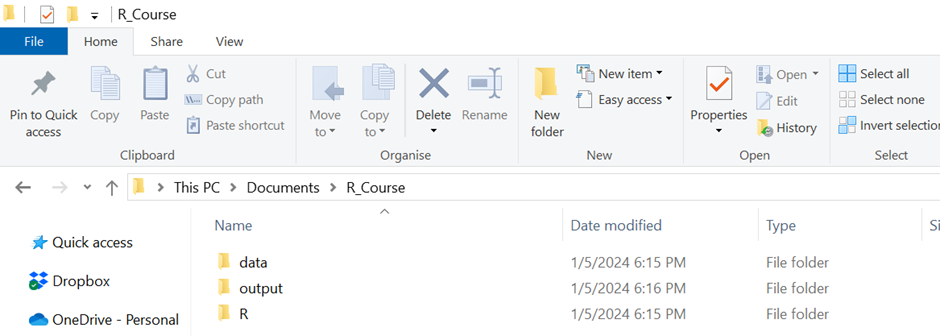
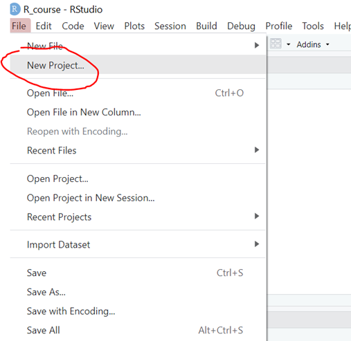
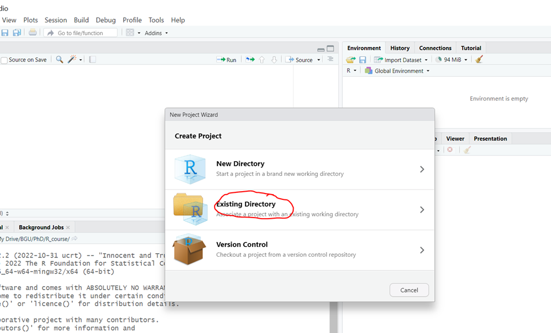
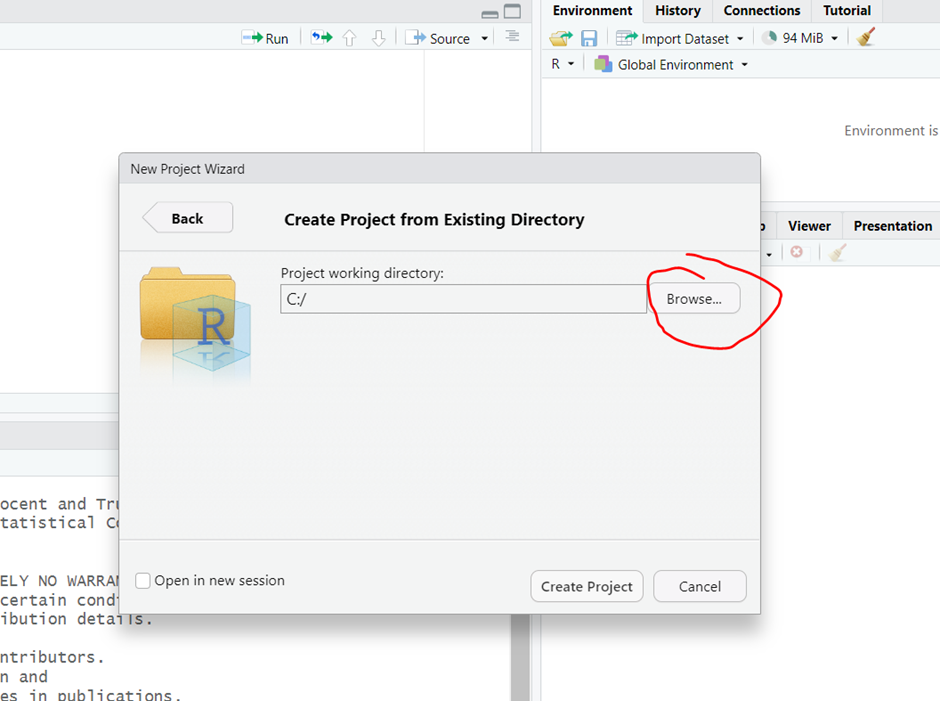
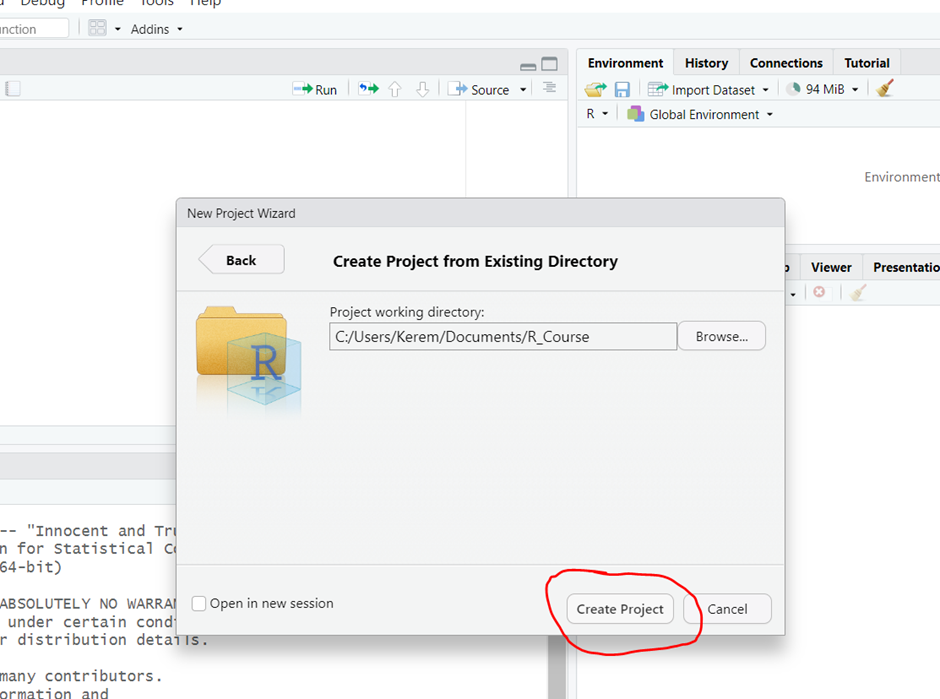
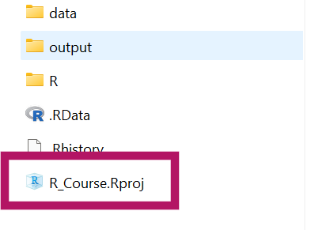
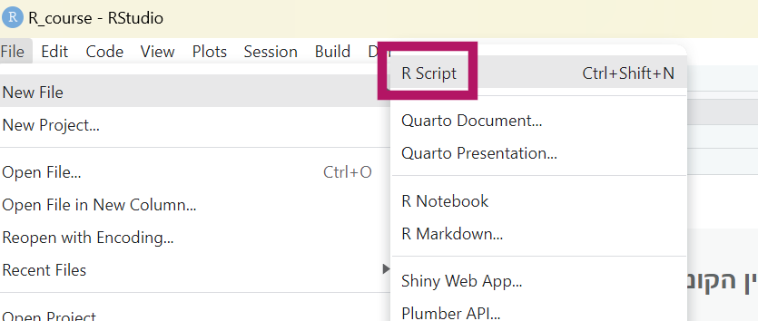

```{r  message=FALSE, warning=FALSE, include=FALSE}


```

::: {dir="rtl"}
## 1. בואו ניצור פרוייקט

כדאי להתחיל בלפתח לעצמכם הרגלים טובים וזה אומר להיות מסודרים. לשם כך אנחנו ניצור פרוייקט (Project). פרוייקט זו בעצם סביבת עבודה שמרכזת את כל מה שצריך עבור, ובכן... הפרוייקט. זה יכול להיות למשל מחקר שאתם עובדים עליו כרגע, או במקרה שלנו הקורס. לא חייבים לעבוד עם קבצי Project, אבל בעיני זה מאד נוח, וכדאי לסגל לעצמכם את ההרגל הזה כבר מעכשיו.

לפני שניצור את הפרוייקט דרך R-Studio, ניצור לנו תיקיה שבה הפרוייקט שלנו ישב. לצורך ההדגמה זו תהיה תקייה בשם R_course בתוך Documents. בתוך התקייה הזו אני ממליצה לשים 3 תתי תקיות:

data - כאן נשים קבצי נתונים שנשתמש בהם לאורך הקורס (למשל קבצי אקסל או CSV או SAV)

R – כאן נשמור את הסקריפטים שניצור במשך הקורס

output – לכאן נייצא תוצרים מתוך R למשל גרפים או טבלאות.

בסופו של דבר אמורה להיות לנו תקייה שנראית ככה:

{width="500"}

**נחזור ל-R וניצור את הפרוייקט הראשון שלנו:**

{width="300"}

**אחרי כמה שניות תיפתח חלונית שנראית ככה ואנחנו נבחר existing directory**

{width="500"}

נחפש את התקייה שיצרנו קודם דרך browse

{width="500"}

וננווט לתקייה שהגדרנו

{width="500"}

**נלחץ על Open ואז Create a project**

{width="500"}

R Studio יטען מחדש ושוב בתוך הפרוייקט שלכם.

בעקרון בכל פעם שתפתחו את R studio הוא יפתח את הפרוייקט האחרון שעבדתם עליו. אם זה לא קורה (או שרוצים לגשת לפרוייקט אחר) אפשר ללכת לתקייה של הפרוייקט ולהפעיל את הקובץ שיש שם עכשיו שנקרא

R_Course.Rproj

{width="250"}
:::

::: {dir="rtl"}
## 2. ההבדל בין הקונסול לקובץ קוד (R Script)

נסו לכתוב תרגיל פשוט בקונסול

למשל **10\*12**

כעת צרו סקריפט חדש ואז כתבו שם את הנוסחה והריצו. מה ההבדל?

{width="400"}

👈 רוב הזמן אנחנו נעבוד עם סקריפט כדי לתעד ולשחזר את מה שעשינו קודם. אבל לפעמים נרצה לבדוק משהו בזריזות שאין לנו צורך לתעד ואז כתיבה ישירות בקונסול יכולה להיות שימושית.
:::

::: {dir="rtl"}
## 3. הרצת סקריפט והתקנת חבילות

א. נוריד את הסקריפט **script_example.R** שנמצא במודל לתקיית R ונטען אותו

ב. נריץ תחילה בנפרד את השורה להתקנת חבילת **tidyverse**

ג. נהפוך את השורה הזו להערה בעזרת סולמית

ד. נריץ את השורה החמישית library(tidyverse) כדי לקרוא לחבילה שהתקנו עכשיו. בדרך כלל כדאי מומלץ לשים בתחילת הקוד את כל החבילות שאנחנו צריכים.

ה. נריץ את יתר הקוד.

👈 עד סוף הקורס אתם תדעו מה אומרות כל השורות בקוד שהרצתם (והרבה יותר מזה).
:::
