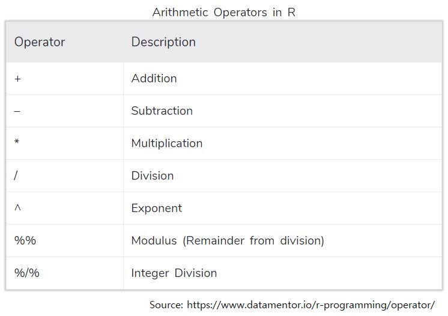
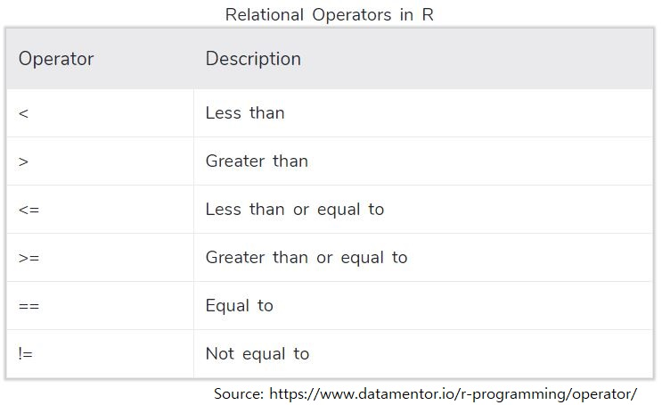

::: {dir="rtl"}
## 1. להתכונן

-   נתקין את חבילות ***Tidyverse ו-readxl***

-   נטען את חבילות ***Tidyverse ו-readxl***

-   נטען ל-R את הקובץ ***trail_df1.xlsx*** ונקרא לו ***trail_df***.
:::

<details>

<summary>Show R code</summary>

```{r}
#install.packages("readxl")
#install.packages("tidyverse")

library(readxl)
library(tidyverse)

trail_df<-read_excel("data/trail_df1.xlsx")
```

</details>

::: {dir="rtl"}
## 2. בחינה כללית של משתנים

-   בדקו את ה-class של המשתנים ***age*****, *diabetes,*** ***group*** .

-   בדקו את ה-class של האובייקט **trail_df**.
:::

<details>

<summary>Show R code</summary>

```{r}
class(trail_df$age)
class(trail_df$diabetes)
class(trail_df$group)

class(trail_df)
```

</details>

::: {.white-bg dir="rtl"}
👈 דרך מהירה להתבונן בכל המשתנים ב-DF שלנו היא בעזרת שתי הפקודות ***glimpse*** ( מתוך חבילת tidyverse) ו-**summary**.

נסו את שתי הפקודות האלו על trail_df
:::

<details>

<summary>Show R code</summary>

```{r}
glimpse(trail_df)
summary(trail_df)
```

</details>

::: {dir="rtl"}
## 3. יצירת משתנה חדש עבור BMI הגישה של tidyverse בעזרת Pipe

אנחנו נעבוד הרבה (מאד) עם ***tidyverse*** לאורך הקורס. כעת נתחיל את הצעדים הראשונים שלנו ונעבוד עם הפונקציה **mutate** ועם **pipe** - שמסומן ככה %\<% או ככה \<\|

-   צרו משתנה חדש שנקרא ***height_m*** שממיר את הגובה בס"מ למטרים
-   צרו משתנה חדש בשם ***bmi*** שמחשב את ה-BMI בעזרת המשתנה ***height_m*** ו-***weight***.

BMI=weight/(height)^2^

שמרו את ה-df בשם חדש **trail_df2**

-   צרו היסטוגרמה מהירה של המשתנה החדש
:::

<details>

<summary>Show R code</summary>

```{r}
trail_df2 <- trail_df %>%  # take the trail_df, copy it to a new df and than...
mutate(height_m=height/100) %>%  # create a new variable for height_m and than...
mutate(bmi=weight/ height_m^2) # calculate BMI

# let's make this code even shorter
trail_df2 <- trail_df %>%  # take the trail_df, copy it to a new df and than...
mutate(bmi=weight/(height/100)^2)

hist(trail_df2$bmi)
```

</details>

::: {dir="rtl"}
[**הפעולות האריתמטיות הנפוצות שאפשר לעשות ב-R**]{.underline}

{width="527"}

👈לכתוב %\<% זה מעצבן אז כדאי להכיר את קיצור המקלדת **Ctrl + Shift + M**
:::

::: {dir="rtl"}
## 4. יצירת משתנה חדש עבור BMI - גישת R base

-   העתיקו את ***trail_df*** לאובייקט חדש וקראו לו ***trail_df3***.

-   ניצור כעת את אותו משתנה BMI בגישת R base

👈 זו השיטה הישנה יותר לעשות פעולות כאלו אנחנו כמעט לא נעבוד באופן הזה.
:::

<details>

<summary>Show R code</summary>

```{r}

trail_df3<- trail_df

trail_df2$height_m<-trail_df2$height/100 
trail_df2$bmi<-trail_df2$weight/trail_df2$height_m^2
```

</details>

::: {dir="rtl"}
## 5. בחירת משתנים ושינוי שם: rename, select

ניצור DF חדש בשם **trail_df_select_rename** על בסיס **trail_df2**

-   נשנה את השם של המשתנה age ל- age_years
-   נבחר את המשתנים sex, age_years ו-bmi
-   ניצור משתנה חדש age_days
-   נוריד רק את המשתנה age_years מה-df
:::

<details>

<summary>Show R code</summary>

```{r}
trail_df_select_rename <- trail_df2 %>% # take trail_df2 and than...
  rename(age_years=age) %>%  #rename age and than...
  select(sex, age_years,bmi) %>% # select only specific vars and than...
  mutate(age_days=age_years*365) %>%  # create a new var and than...
  select(-age_years)  # remove age_years variable
```

</details>

::: {dir="rtl"}
## 6. סינון: filter

ניצור DF חדש בשם **trail_df_filtered** על בסיס **trail_df2**

-   נשאיר רק משתתפים עם BMI תקין (מתחת ל-25)
-   ננסה לשנות את התנאי כך שיכלול גם משתתפים עם BMI 25
-   נשאיר רק את אלו עם מחלת לב
-   נוריד מה-DF את קבוצת הביקורת
-   ננסה לעשות את הכל בשלב אחד ונתנסה בשימוש ב-AND ("&" בקוד R)
-   נחליף את ה-AND ב-OR ("\|" בקוד R) ונקרא ל-df הנוסף **trail_df_filtered2**

### טבלה של כל האופרטרים ב-R

{width="606"}
:::

<details>

<summary>Press to show R code</summary>

```{r}
#filter out exclusion createra
trail_df_filtered <- trail_df2 %>% 
  filter(bmi<25)

trail_df_filtered <- trail_df2 %>% 
  filter(bmi <=25) %>% 
  filter(CVD ==TRUE) %>% 
  filter(group !="control")

#in one step:
trail_df_filtered <- trail_df2 %>% 
  filter(bmi <=25 & CVD ==TRUE & group !="control")


trail_df_filtered2 <- trail_df2 %>% 
  filter(bmi <=25 | CVD ==TRUE | group !="control")
```

</details>

::: {.white-bg dir="rtl"}
נפטר מ-trail_df בעזרת rm.
:::

<details>

<summary>Show R code</summary>

```{r}
rm(trail_df)
```

</details>
